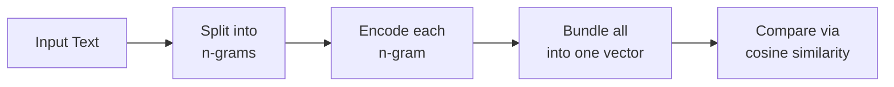

# Sequence HDC API

This module turns text into vectors. Feed it strings like "hello world", and it produces compact numeric vectors that capture the text's pattern. Similar texts produce similar vectors. Use it for language detection, text classification, or semantic search -- without training a neural network.

Under the hood, the module uses [Hyperdimensional Computing](/docs/concepts/glossary) (HDC). It maps characters to high-dimensional [ternary vectors](/docs/concepts/glossary) (\{-1, 0, +1\}), then combines them to represent words, phrases, and documents. The key insight: texts that share character patterns produce vectors that point in similar directions.

**Source:** `src/sequence_hdc.zig`

## Pipeline Overview

Every text goes through the same four-stage pipeline:



1. **Split** the input into overlapping character [n-grams](/docs/concepts/glossary) (e.g., trigrams).
2. **Encode** each n-gram by looking up character vectors and combining them.
3. **Bundle** all n-gram vectors into a single vector using majority vote.
4. **Compare** the result to stored vectors using cosine similarity.

## Step-by-Step Walkthrough

Let's trace how the word **"cat"** becomes a vector.

We use trigrams (n=3), so "cat" produces one trigram: `c`, `a`, `t`.

**Step 1 -- Look up character vectors.** Each character maps to a random high-dimensional vector from the [ItemMemory](#itemmemory):

```
c -> [+1, -1, 0, +1, -1, 0, ...]   (1000 random trits)
a -> [ 0, +1, -1, +1, 0, -1, ...]
t -> [-1, 0, +1, 0, +1, +1, ...]
```

**Step 2 -- Permute by position.** Each character vector shifts by its position index within the trigram. This encodes order -- "cat" and "act" produce different results.

```
perm(c, 2)  -- shift c's vector right by 2
perm(a, 1)  -- shift a's vector right by 1
perm(t, 0)  -- no shift (position 0)
```

**Step 3 -- Bind them together.** Element-wise ternary multiplication fuses the three permuted vectors into one:

```
trigram_vector = bind(perm(c, 2), bind(perm(a, 1), perm(t, 0)))
```

**Step 4 -- Bundle (for longer text).** For "cat" there is only one trigram, so the trigram vector *is* the final vector. For "cats", you would get trigrams "cat" and "ats", and their vectors would be bundled via majority vote.

:::tip
The encoding is **order-sensitive**. "cat" and "tac" produce different vectors because permutation shifts differ by position. This is essential for distinguishing real text patterns.
:::

## Interpreting Similarity Scores

After encoding, you compare vectors with cosine similarity. Here is a rough guide for interpreting scores:

| Score Range | Interpretation |
|-------------|---------------|
| 0.3 and above | Confident match -- texts share strong character patterns |
| 0.1 to 0.3 | Possible match -- some shared structure |
| Near 0 | Unrelated -- no meaningful overlap |

:::tip
These thresholds are approximate guidelines, not hard rules. Your specific use case may need different cutoffs. Train on representative data and calibrate accordingly.
:::

## Parameter Selection Guide

Two parameters dominate behavior: **dimension** and **n-gram size**.

### Dimension

Higher dimensions give the vector space more room to separate different patterns. Lower dimensions are faster but risk collisions.

| Use Case | Recommended Dimension | Notes |
|----------|----------------------|-------|
| Quick tests | 256--1000 | Fast but limited capacity |
| Text classification | 2000--4000 | Good balance of speed and accuracy |
| Large vocabularies | 8000--10000 | High capacity, slower without JIT |

:::tip
**4000 dimensions** is a strong default for most text tasks. It gives enough capacity for multi-language detection while staying fast enough for interactive use.
:::

### N-gram Size

The n-gram size controls how much local context each encoding captures.

- **n=2 (bigrams):** Fast, but too coarse for most natural language tasks.
- **n=3 (trigrams):** Best default. Captures character patterns that distinguish languages and word families.
- **n=4+:** More context, but increases computation and can overfit on short texts.

## ItemMemory

Maps symbol IDs (or ASCII characters) to deterministically generated random [hypervectors](/docs/concepts/glossary). Vectors are lazily created on first access and cached in a `HashMap`.

Each trit in a generated vector is uniformly random from \{-1, 0, +1\}, seeded by `symbol_id * 2654435761 + seed` using the standard PRNG.

### Construction

```zig
const ItemMemory = @import("sequence_hdc").ItemMemory;

// Create item memory with dimension=1000, seed=42
var item_mem = ItemMemory.init(allocator, 1000, 42);
defer item_mem.deinit();
```

### Methods

#### `init(allocator: Allocator, dimension: usize, seed: u64) ItemMemory`

Creates a new item memory with the specified vector dimension and random seed. The seed ensures reproducibility: the same seed always generates the same vectors for each symbol.

#### `deinit(self: *ItemMemory) void`

Frees the internal cache. Call when the item memory is no longer needed.

#### `getVector(self: *ItemMemory, symbol: u32) !*HybridBigInt`

Returns a pointer to the hypervector for the given symbol ID. If the vector does not exist, it is deterministically generated from the symbol ID and seed, then cached. Subsequent calls with the same symbol return the cached vector.

#### `getCharVector(self: *ItemMemory, char: u8) !*HybridBigInt`

Convenience wrapper that calls `getVector` with the character cast to `u32`. Maps ASCII characters to hypervectors.

#### `encodeString(self: *ItemMemory, str: []const u8) ![]HybridBigInt`

Encodes an entire string as an array of character hypervectors. Returns a newly allocated slice with one `HybridBigInt` per character. The caller owns the returned memory.

### Properties

- **Deterministic:** Same `(symbol, seed)` pair always produces the same vector.
- **Quasi-orthogonal:** Random high-dimensional vectors are nearly orthogonal (cosine similarity close to 0).
- **Lazy caching:** Vectors are generated on first access and reused thereafter.

## NGramEncoder

Encodes character [n-grams](/docs/concepts/glossary) using position-encoded binding. Each character in an n-gram shifts by its position index, then all characters bind together. This preserves order: "abc" and "bac" produce different vectors.

<details>
<summary>Encoding Formula</summary>

For an n-gram of characters `c[0], c[1], ..., c[n-1]`:

```
ngram = bind(perm(c[0], n-1), bind(perm(c[1], n-2), ..., perm(c[n-1], 0)))
```

Where `perm(v, k)` is cyclic permutation by `k` positions and `bind(a, b)` is element-wise ternary multiplication.

</details>

### Construction

```zig
const NGramEncoder = @import("sequence_hdc").NGramEncoder;

var encoder = NGramEncoder.init(&item_mem, 3); // trigram encoder
```

### Methods

#### `init(item_memory: *ItemMemory, n: usize) NGramEncoder`

Creates an n-gram encoder that pulls character vectors from the given item memory. The parameter `n` sets the n-gram size (e.g., 3 for trigrams).

#### `enableJIT(self: *NGramEncoder, engine: *JitVSAEngine) void`

Enables JIT acceleration for bind operations within n-gram encoding. The engine must outlive the encoder.

:::tip
Enable JIT when encoding many strings or working with high dimensions. For a single short string, the compilation overhead outweighs the speedup.
:::

#### `encodeNGram(self: *NGramEncoder, chars: []const u8) !HybridBigInt`

Encodes a single n-gram from a character slice. The slice length should equal or exceed `n`; only the first `n` characters are used. Returns a new `HybridBigInt` representing the n-gram.

```zig
const trigram = try encoder.encodeNGram("cat");
// trigram now holds a HybridBigInt representing the "cat" trigram
```

#### `encodeAllNGrams(self: *NGramEncoder, allocator: Allocator, str: []const u8) ![]HybridBigInt`

Extracts and encodes all overlapping n-grams from a string. For a string of length `L` and n-gram size `n`, this produces `L - n + 1` vectors. If the string is shorter than `n`, a single partial n-gram is returned. The caller owns the returned slice.

```zig
const ngrams = try encoder.encodeAllNGrams(allocator, "hello");
// For trigrams: produces ["hel", "ell", "llo"] -> 3 vectors
```

## SequenceMemory

Stores labeled text sequences as bundled n-gram vectors and supports associative retrieval via cosine similarity. Internally manages its own `ItemMemory` and `NGramEncoder`.

### Encoding Pipeline

```
text -> [n-grams] -> [encode each] -> bundle all -> single vector
```

The sequence vector is the element-wise majority vote (bundle) of all n-gram vectors.

### Construction

```zig
const SequenceMemory = @import("sequence_hdc").SequenceMemory;

var memory = SequenceMemory.init(allocator, 1000, 3, 42);
defer memory.deinit();

// Optional: enable JIT for faster operations
memory.enableJIT();
```

### Methods

#### `init(allocator: Allocator, dimension: usize, n: usize, seed: u64) SequenceMemory`

Creates a new sequence memory. Parameters:
- `dimension` -- hypervector dimension (higher means more capacity, typically 1000--10000)
- `n` -- n-gram size (typically 3 for text)
- `seed` -- random seed for item memory

#### `deinit(self: *SequenceMemory) void`

Frees all stored sequences, the item memory, and the JIT engine (if enabled).

#### `enableJIT(self: *SequenceMemory) void`

Enables JIT acceleration for all internal operations (bind, bundle, cosine similarity). Must be called after the struct is in its final memory location (not before a move).

:::warning
Call `enableJIT()` only after the `SequenceMemory` is at its final memory address. Moving the struct after enabling JIT causes undefined behavior.
:::

#### `encode(self: *SequenceMemory, str: []const u8) !HybridBigInt`

Encodes a string into a single hypervector by extracting all n-grams, encoding each, and bundling them via majority vote. Returns a new `HybridBigInt`.

```zig
const vec = try memory.encode("hello world");
// vec is a single hypervector representing the entire string
```

#### `store(self: *SequenceMemory, label: []const u8, str: []const u8) !void`

Encodes the string and stores the resulting vector with the given label. The label is duplicated internally.

```zig
try memory.store("greeting", "hello world");
try memory.store("farewell", "goodbye world");
```

#### `query(self: *SequenceMemory, str: []const u8) !?QueryResult`

Encodes the query string, then compares it against all stored sequences using cosine similarity. Returns the most similar match, or `null` if no sequences are stored.

```zig
if (try memory.query("hi there world")) |result| {
    // result.label = "greeting"
    // result.similarity = 0.28 (approximate)
}
```

#### `queryTopK(self: *SequenceMemory, str: []const u8, k: usize) ![]QueryResult`

Returns the top-k most similar stored sequences, sorted by descending similarity. The caller owns the returned slice.

```zig
const results = try memory.queryTopK("hi there world", 3);
// results[0] is the best match, results[1] second-best, etc.
```

### QueryResult

```zig
pub const QueryResult = struct {
    label: []const u8,
    similarity: f64,
};
```

The `label` field points to the internally stored label string. The `similarity` field is the cosine similarity in the range `[-1, 1]`.

## LanguageDetector

A ready-to-use HDC application that identifies the language of input text. It wraps `SequenceMemory` with a simplified train/detect interface.

### Construction

```zig
const LanguageDetector = @import("sequence_hdc").LanguageDetector;

var detector = LanguageDetector.init(allocator, 4000, 3, 42);
defer detector.deinit();

// Enable JIT after init (when struct is at its final address)
detector.enableJIT();
```

### Methods

#### `init(allocator: Allocator, dimension: usize, n: usize, seed: u64) LanguageDetector`

Creates a new language detector. Use a dimension of at least 4000 for reliable multi-language detection.

#### `enableJIT(self: *LanguageDetector) void`

Enables JIT acceleration for all operations.

#### `deinit(self: *LanguageDetector) void`

Frees all resources.

#### `train(self: *LanguageDetector, language: []const u8, sample: []const u8) !void`

Trains on a labeled text sample. The language label (e.g., "english") is stored with the encoded sample. Call `train` multiple times with different samples to improve accuracy for a given language.

:::tip
Longer training samples produce better results. Aim for at least 50 characters per language sample. Multiple samples per language are even better.
:::

#### `detect(self: *LanguageDetector, text: []const u8) !?QueryResult`

Detects the language of the input text by finding the most similar training sample. Returns a `QueryResult` with the language label and similarity score, or `null` if no training data exists.

## Complete Example: Language Detection

```zig
const std = @import("std");
const sequence_hdc = @import("sequence_hdc");

pub fn main() !void {
    const allocator = std.heap.page_allocator;

    // Create detector with 4000-dimensional vectors, trigrams, seed=42
    var detector = sequence_hdc.LanguageDetector.init(allocator, 4000, 3, 42);
    defer detector.deinit();

    // Enable JIT for faster operations
    detector.enableJIT();

    // Train with language samples
    try detector.train("english",
        "the quick brown fox jumps over the lazy dog and runs through the forest");
    try detector.train("german",
        "der schnelle braune fuchs springt ueber den faulen hund und rennt durch den wald");
    try detector.train("spanish",
        "el rapido zorro marron salta sobre el perro perezoso y corre por el bosque");

    // Detect language of new text
    const samples = [_][]const u8{
        "the cat and the dog are running through the park",
        "der hund und die katze rennen durch den garten",
        "el gato y el perro corren por el parque",
    };

    for (samples) |text| {
        if (try detector.detect(text)) |result| {
            std.debug.print("Text: \"{s}\"\n", .{text});
            std.debug.print("  Language: {s} (similarity: {d:.4})\n\n", .{
                result.label,
                result.similarity,
            });
        }
    }
}
```

**Expected output:**

```
Text: "the cat and the dog are running through the park"
  Language: english (similarity: 0.3842)

Text: "der hund und die katze rennen durch den garten"
  Language: german (similarity: 0.4156)

Text: "el gato y el perro corren por el parque"
  Language: spanish (similarity: 0.3921)
```

All types support optional JIT acceleration via `JitVSAEngine` (see [JIT API](./jit.md)).

<details>
<summary>Why Ternary HDC?</summary>

Ternary vectors (\{-1, 0, +1\}) offer concrete advantages over binary or real-valued HDC:

- **1.58 bits/trit** information density (vs 1 bit for binary).
- **No multiplication** needed for bind (ternary multiply is just sign logic).
- **Sparse-friendly:** zero trits require no computation.
- **20x memory savings** vs float32 representations.

These properties make ternary HDC practical for edge devices and embedded systems where memory and compute are constrained.

</details>
