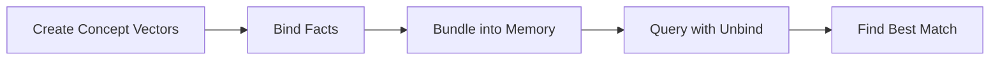

# Tutorial: Build a Semantic Memory

Learn Trinity's core operations by building a simple knowledge store that can answer questions.

Most AI systems need expensive GPUs and millions of training examples to learn facts. Trinity's Vector Symbolic Architecture takes a different approach. You can store and retrieve knowledge using simple math on ternary vectors. No training loop. No neural network. No GPU. This tutorial shows you how.

## What We Will Build

We will build a knowledge store that remembers facts like "France's capital is Paris" and can answer the question "What is France's capital?" The entire system runs in a single Zig file with zero dependencies beyond Trinity.

:::tip Key Insight
VSA memory works like a hologram. Every fact is spread across the entire vector. You can store many facts in one vector and query any of them individually.
:::

Here is the pipeline we will follow:



## Step 1: Create Random Vectors

Every concept in our system gets its own random [hypervector](/docs/concepts/glossary). Random vectors in high dimensions have a useful property: they are almost always unrelated to each other. Mathematicians call this [quasi-orthogonal](/docs/concepts/glossary).

```zig
const vsa = @import("vsa.zig");

// Create vectors for concepts
var france = vsa.randomVector(1000, 1);
var paris = vsa.randomVector(1000, 2);
var germany = vsa.randomVector(1000, 3);
var berlin = vsa.randomVector(1000, 4);
var role_capital = vsa.randomVector(1000, 100);

// Random vectors are nearly orthogonal (unrelated)
const sim = vsa.cosineSimilarity(&france, &paris);
// Output: sim ≈ 0.01 (essentially zero — unrelated concepts)
```

Each call to `randomVector` takes two arguments: the number of [dimensions](/docs/concepts/glossary) and a seed. The seed ensures reproducible results. With 1000 dimensions, any two random vectors will have near-zero [cosine similarity](/docs/concepts/glossary).

:::tip Why 1000 Dimensions?
Higher dimensions give cleaner separations between unrelated concepts. At 1000 dimensions, random vectors reliably have similarity below 0.05. At 100 dimensions, collisions become more likely. For production systems, 4000-10000 dimensions are common.
:::

## Step 2: Bind Facts

[Binding](/docs/concepts/glossary) links two concepts together. It works like a key-value pair: one vector is the key and the other is the value. The bound result is dissimilar to both inputs.

```zig
// Create "capital" facts by binding role to city, then country to role-city
var fact1 = vsa.bind(&role_capital, &paris);
var binding1 = vsa.bind(&france, &fact1);
// binding1 now encodes: "France → capital → Paris"

var fact2 = vsa.bind(&role_capital, &berlin);
var binding2 = vsa.bind(&germany, &fact2);
// binding2 now encodes: "Germany → capital → Berlin"
```

Binding uses element-wise multiplication of [trits](/docs/concepts/glossary). When you multiply two trits:
- `+1 * +1 = +1`
- `+1 * -1 = -1`
- Anything `* 0 = 0`

The result scrambles both input patterns. That is why the bound vector is dissimilar to either input on its own.

## Step 3: Bundle into Memory

[Bundling](/docs/concepts/glossary) combines multiple vectors into one. Unlike binding, the result stays similar to all of its inputs. Think of it as superimposing facts on top of each other.

```zig
// Combine both facts into a single memory vector
var memory = vsa.bundle2(&binding1, &binding2);
// memory holds both facts simultaneously
```

Bundling uses a [majority vote](/docs/concepts/glossary) at each position. For two vectors, ties (where the trits differ) are broken randomly. Despite this lossy compression, the signal from each input survives because the vectors are so high-dimensional.

:::warning Capacity Limits
A single memory vector can hold roughly the square root of its dimension count in facts. A 1000-dimensional vector stores around 30 facts reliably. Beyond that, the noise floor rises and retrieval accuracy drops. Increase dimensions for larger knowledge bases.
:::

## Step 4: Query the Memory

Now for the magic. To ask "What is France's capital?", we construct a query and [unbind](/docs/concepts/glossary) it from memory.

```zig
// Construct query: bind France with capital role
var query = vsa.bind(&france, &role_capital);

// Unbind query from memory to get noisy answer
var answer = vsa.unbind(&memory, &query);

// Compare answer to known cities
const sim_paris = vsa.cosineSimilarity(&answer, &paris);
const sim_berlin = vsa.cosineSimilarity(&answer, &berlin);
// Output: sim_paris ≈ 0.35, sim_berlin ≈ 0.02
// Paris wins! The memory correctly recalls the capital.
```

The answer vector is noisy because the memory also contains the Germany-Berlin fact. But the signal for Paris is strong enough to stand out clearly. The correct answer always has the highest similarity.

:::tip How Unbinding Works
Unbinding is the inverse of binding. Because binding uses multiplication and trits are their own inverses (`-1 * -1 = +1`), unbinding is actually the same operation as binding. When you unbind the query from memory, you cancel out the France and role_capital patterns, leaving behind a noisy version of Paris.
:::

## What Just Happened?

Here is a summary of the four operations you just used:

| Operation | Purpose | Analogy |
|-----------|---------|---------|
| `randomVector` | Create a concept | A unique word in a dictionary |
| `bind` | Link two concepts | A key-value pair |
| `bundle2` | Combine facts into memory | Superimposing holograms |
| `unbind` + `cosineSimilarity` | Retrieve an answer | Looking up a key, finding closest match |

The entire system has these properties:

- **No training.** Facts are stored instantly with a single operation.
- **No neural network.** Pure vector algebra handles storage and retrieval.
- **No GPU needed.** Ternary operations are additions and sign flips.
- **Constant-time retrieval.** Query cost does not grow with the number of stored facts.
- **Fixed memory footprint.** One vector holds many facts. A 1000-trit vector uses about 200 bytes in [packed mode](/docs/concepts/glossary).

## Next Steps

You now understand the core building blocks of Trinity's VSA engine. Here is where to go next:

- [VSA API Reference](/docs/api/vsa) -- full documentation of bind, bundle, permute, and similarity functions
- [HybridBigInt Storage](/docs/api/hybrid) -- learn about packed and unpacked modes for efficient memory use
- [Sequence HDC](/docs/api/sequence-hdc) -- encode text as hypervectors using n-grams and permutations
- [Glossary](/docs/concepts/glossary) -- quick reference for all Trinity terminology
