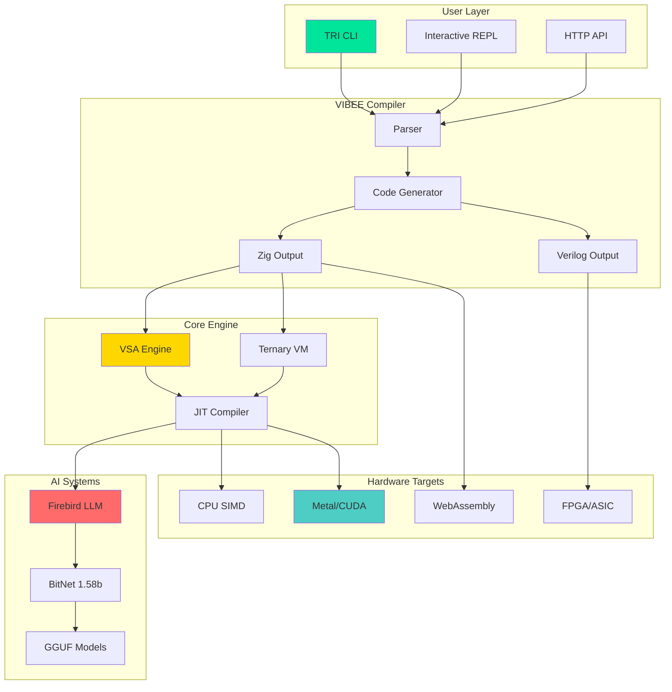
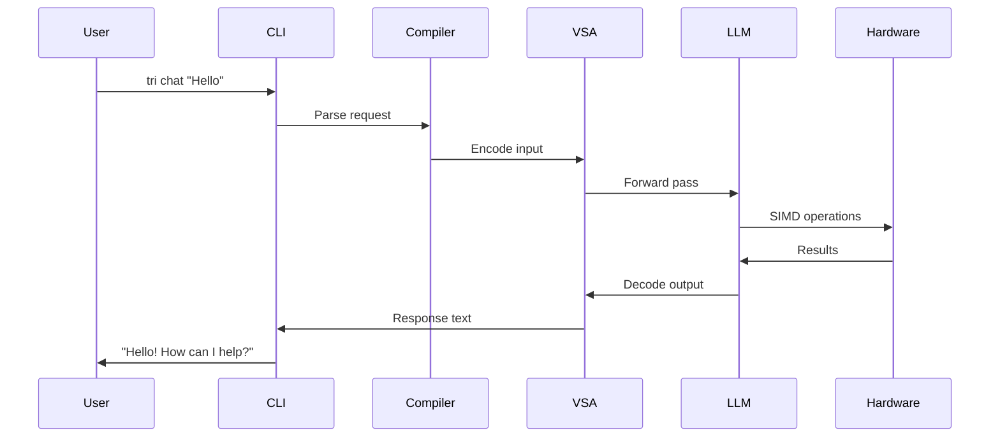

# Technology Tree

## Interactive Architecture

## Component Details

### Layer 1: User Interface

| Component | Description | Status |
|-----------|-------------|--------|
| TRI CLI | Unified command-line interface | Complete |
| REPL | Interactive mode with commands | Complete |
| HTTP API | REST API for integrations | Complete |

### Layer 2: VIBEE Compiler

| Component | Description | Status |
|-----------|-------------|--------|
| Parser | YAML-based spec parsing | Complete |
| Code Generator | Multi-target output | Complete |
| Zig Output | High-performance code | Complete |
| Verilog Output | FPGA synthesis | Beta |

### Layer 3: Core Engine

| Component | Description | Status |
|-----------|-------------|--------|
| VSA Engine | Vector Symbolic Architecture | Complete |
| Ternary VM | Stack-based bytecode executor | Complete |
| JIT Compiler | Runtime optimization | Complete |

### Layer 4: AI Systems

| Component | Description | Status |
|-----------|-------------|--------|
| Firebird | LLM inference engine | Complete |
| BitNet | 1.58-bit neural networks | Complete |
| GGUF | Model format support | Complete |

### Layer 5: Hardware Targets

| Component | Description | Status |
|-----------|-------------|--------|
| CPU SIMD | AVX-512, NEON | Complete |
| Metal/CUDA | GPU acceleration | In Progress |
| FPGA/ASIC | Hardware synthesis | Planned |
| WebAssembly | Browser deployment | Complete |

## Data Flow

## Golden Chain Pipeline

The development process follows 16 enforced links:

```mermaid
flowchart LR
    subgraph Analysis["Analysis"]
        L1[1. Baseline]
        L2[2. Metrics]
        L3[3. PAS]
        L4[4. Tech Tree]
    end

    subgraph Development["Development"]
        L5[5. Spec]
        L6[6. Generate]
        L7[7. Test]
    end

    subgraph Benchmark["Benchmark"]
        L8[8. vs Prev]
        L9[9. vs External]
        L10[10. vs Theory]
    end

    subgraph Finalize["Finalize"]
        L11[11. Delta]
        L12[12. Optimize]
        L13[13. Docs]
        L14[14. Verdict]
        L15[15. Git]
        L16[16. Loop]
    end

    L1 --> L2 --> L3 --> L4
    L4 --> L5 --> L6 --> L7
    L7 --> L8 --> L9 --> L10
    L10 --> L11 --> L12 --> L13 --> L14 --> L15 --> L16
    L16 -->|φ⁻¹ threshold| L1

    style L7 fill:#FF6B6B
    style L8 fill:#FF6B6B
    style L16 fill:#FFD700
```

**Critical Links (fail-fast):**
- Link 7: Test Run
- Link 8: Benchmark vs Previous

**Loop Condition:**
- Improvement > φ⁻¹ (61.8%) → IMMORTAL
- Improvement < φ⁻¹ → Loop back to Link 1

---

**φ² + 1/φ² = 3 = TRINITY**
